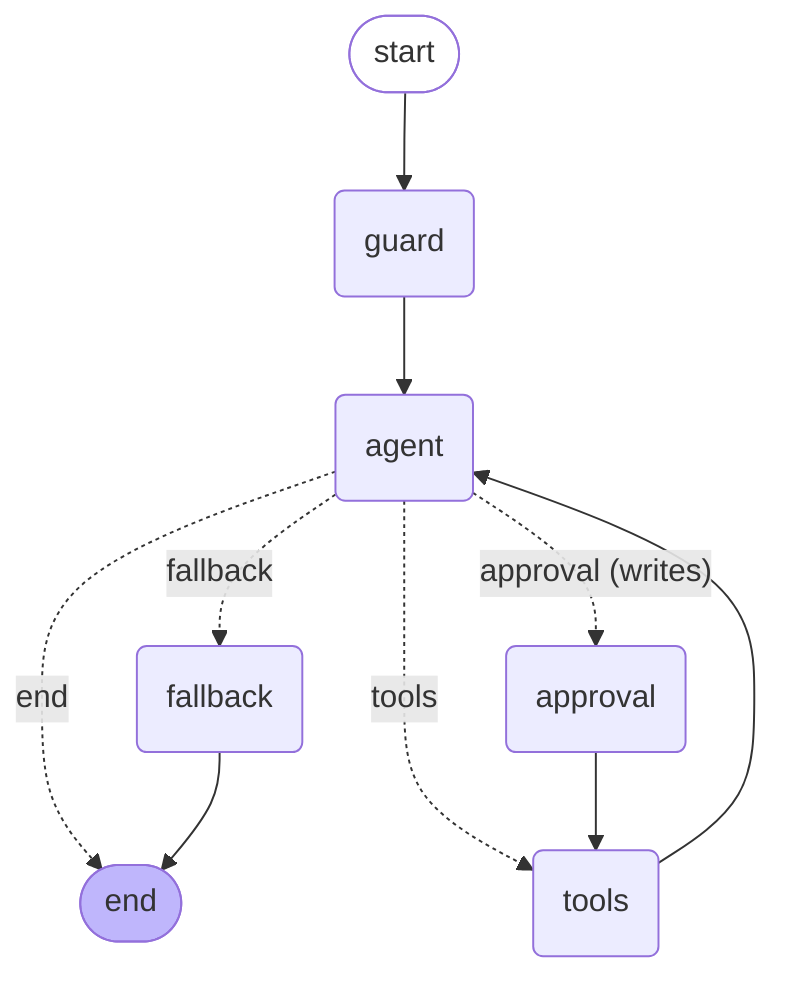

# Albert School — Student Assistant Agent

A LangGraph agent that answers an Albert School student's natural-language questions about **their own studies**: their program and current courses, a course's assessment/topics/documents, their attendance, and their grades — and, in V2, the school logistics that live in their **Gmail** and **Google Calendar** (deadlines, schedules, messages from teachers). It combines the **live Albert intranet API**, a **RAG retriever** over the student's official PDF documents, and **Google Workspace** access — read mail & calendar, draft & send email, create events — as tools, runs on **Groq**, and is used through a **Streamlit** chat UI. Every outward-facing **write** (sending an email, creating a calendar event) is gated behind a **human-in-the-loop** approval step; reading and drafting are not.

> Built for the "Introduction to generative AI" final project. It targets both the mandatory bar *and* several "Going further" extensions (see [Extensions](#going-further-extensions)).

---

## What it does, and why an agent

A student can ask, in French or English and in any order:

- *"What classes am I taking this semester?"*
- *"How is the generative AI course graded?"*
- *"What is my attendance rate, and where am I least consistent?"*
- *"What is my average grade per teaching unit?"*
- *"According to my official transcript, what courses did I complete in my first year?"*
- *"If I get a 70 on the written exam, a 75 on the practical exam, and an 85 on the project, what is my final grade?"*
- *"Any email from my professor about the exam this week?"*
- *"What's on my calendar tomorrow?"*
- *"Draft an email to my professor to say I'll be absent — then send it once I approve."*
- *"Add a revision session to my calendar tomorrow from 2 to 4pm."*

These questions don't map to one fixed pipeline: each needs a **different tool (or combination of tools)**, the right **identifiers**, and sometimes a **follow-up computation**. That is exactly what an agent is for — the LLM reads the request, decides which tool(s) to call, the graph runs them, and the loop repeats until the model can answer. A linear `prompt | llm` chain could not pick between attendance, grades, the syllabus API and the document store, nor compose two of them in one turn.

The data tools do all the arithmetic in Python (pandas) and hand the model **already-computed** numbers, so the LLM is never trusted to average JSON — it orchestrates and explains.

---

## Graph design

The agent is the canonical ReAct loop built explicitly as a `StateGraph`, so every node and edge is visible and testable.



**State** (`TypedDict`) — only the four fields the graph reads or writes:

| Field | Type | Role |
|---|---|---|
| `messages` | `Annotated[list, add_messages]` | chat history + tool results, accumulated via the `add_messages` reducer |
| `iterations` | `int` | tool-loop counter for the current turn (safety harness) |
| `require_approval` | `bool` | whether the HITL email gate is on (set by the UI per run) |
| `approved` | `str \| None` | the student's decision (`"approve"`/`"deny"`) for a pending email read |

**Nodes** (each is `State -> partial State`):

| Node | Job |
|---|---|
| `guard` | entry point; resets `iterations` to 0 and clears `approved` at the start of every user turn (the checkpointer persists them across turns, so they must be reset) |
| `agent` | calls the Groq LLM (tools bound); it either answers or requests tool calls; increments `iterations` |
| `approval` | **human-in-the-loop gate**: `interrupt`s before any **write** tool runs (send mail / create event), surfaces the pending action, and records the student's decision in `approved` |
| `tools` | runs every requested tool (supports parallel calls), with per-call error handling and de-duplication; **skips** a sensitive tool unless `approved == "approve"` |
| `fallback` | safe exit when the loop budget is exhausted: it answers each still-pending tool call with a `ToolMessage`, then returns a graceful message — leaving a valid conversation the next turn can build on |

**The conditional edge** `route_after_agent` is the one real decision point, and it routes **four different ways** depending on the State (checked in priority order):

- **→ `end`** — the model produced a final answer (no tool calls);
- **→ `fallback`** — the loop budget is exhausted (safety);
- **→ `approval`** — the request would send an email or create a calendar event (an outward-facing write) and the gate is on (HITL);
- **→ `tools`** — the model asked for tool(s) and none of the above applies.

Each branch is exercised by the evaluation suite (a greeting routes to `end`, a data question routes through `tools`, a send-email/create-event request routes to `approval`, and a budget-capped case routes to `fallback`), so no branch is dead code.

### System prompt

The prompt is part of the design. The `agent` node prepends this (it is not stored in the state, to avoid duplication), with **today's date injected** each turn so the agent can resolve relative dates ("this week", "tomorrow") for the calendar and attendance tools:

```
You are the Albert School student assistant. You help one signed-in student get clear, accurate answers about their own studies: their program and current courses, a course's assessment/topics/documents, their attendance, and their grades. You also help with school logistics in their Gmail and Google Calendar: read mail and events, draft and send email, and create calendar events (deadlines, schedules, messages from teachers).

Today's date is {today}. Use it to resolve relative dates ("this week", "tomorrow", "next month", "in March") into concrete dates for the calendar and attendance tools.

How to work:
- Always ground answers in tool results. Never invent grades, rates, dates, course names, emails, events or documents. If you don't have it, say so.
- Use your tools to fetch program/course info, attendance rates, grade averages, and the official PDF documents; use mail and calendar for logistics; use the calculator for any arithmetic.
- Mind the two grade sources, they are different: [/100 live API vs /20 PDF transcripts — search the documents for a past year, a transcript, a certificate].
- Reading email and calendar is free: search the inbox with Gmail operators (from:, subject:, is:unread, newer_than:7d), open a message by its id, and list calendar events. Never use mail or calendar to answer a question about grades, attendance or the syllabus — those have their own tools.
- Writing: you may DRAFT an email freely — it is saved, never sent. When the student asks you to SEND an email or to ADD/CREATE a calendar event, call the matching tool right away with the details — do NOT ask for confirmation yourself, and do NOT just describe what you would do. The app automatically pauses and asks the student to approve before the action actually runs, so calling the tool IS how you request that approval. If the student declines, acknowledge it and do not retry.
- You may call several tools at once when a question needs more than one, but do not call the same tool twice with the same arguments.
- After your tools return, write a complete, direct answer for the student using their results — give the actual numbers and facts. Never reply with meta-comments about the tool calls, and never mention internal tool or function names; describe what you can do in plain words.
- Be concise and factual. Reply in the same language the student used.
```

---

## Tools

Twelve tools, each with one responsibility and its own error handling (a failure returns a `⚠️ …` message instead of raising, so one bad call never breaks the graph). The two 🔒 tools are the outward-facing **writes** (send mail, create event); the approval node gates them. Reading and drafting are ungated.

| Tool | Responsibility | Source |
|---|---|---|
| `list_my_program` | program enrolment + this semester's courses | API: profile + courses |
| `get_course_details` | one course's assessment, topics, documents | API: courses + syllabus + documents |
| `get_attendance_summary` | attendance rate (overall / by course / by month) | API: attendance → pandas |
| `get_grades_summary` | averages (overall / by teaching unit / by course) | API: grades → pandas |
| `search_school_documents` | the enrollment certificate + historical transcripts | RAG: Chroma + FastEmbed |
| `calculator` | safe arithmetic for hypotheticals / cross-source math | local AST evaluator |
| `search_emails` | recent / matching Gmail messages (Gmail query syntax) | Gmail API (read) |
| `read_email` | the full body of one email by id | Gmail API (read) |
| `get_calendar_events` | events in a date window (defaults to next 7 days) | Calendar API (read) |
| `draft_email` | compose & save an email draft — never sent | Gmail API (write) |
| `send_email` 🔒 | send an email (`to`, `subject`, `body`) | Gmail API (write) |
| `create_calendar_event` 🔒 | create an event (`summary`, `start`, `end`…) | Calendar API (write) |

**Tool boundaries within Google.** Reads come in two steps: `search_emails` lists matches (sender, subject, date, snippet, id) and `read_email` opens *one* message in full by that id. Writes split the same way, by *consequence*: `draft_email` only **saves** a draft — nothing leaves the mailbox, so it is ungated — while `send_email` and `create_calendar_event` actually act on the outside world and are therefore gated by the approval node. The OAuth scopes are now write-capable (`gmail.compose`, `calendar.events`); the safety here is the **human gate**, not a read-only scope.

**Tools deliberately *not* included.** *Web search* — every question is about the student's own school data; the web adds noise and a chance to answer off-topic, so it is excluded on purpose. *Deleting or editing existing mail/events* — the writes are limited to the two safe, additive actions a student actually asks for (send a message, add an event); the same approval gate would cover more, but they weren't needed. *Database query* / *file reader* — there is no database, and reading the PDFs is part of building the RAG index, not a separate runtime tool. This is a considered tool selection, not the full suggested list.

---

## Key design choices

- **Aggregation in Python, not in the prompt.** Attendance rates and grade averages are *derived* (the API returns raw records, never summaries). All of that lives in `aggregations.py` with pandas, where the rules are explicit and unit-testable; the LLM only relays the result.
- **Two grade scales, kept apart.** The live API grades are on **/100**; the PDF transcripts are the official record on **/20** with letter grades and ECTS. The system prompt and the tool descriptions keep these from being conflated.
- **The two-identifier trap.** The API uses **two different** student ids — `ALBERT_USER_ID` for courses/attendance and `ALBERT_STUDENT_ID` for grades — and swapping them returns wrong data with no HTTP error. Each `fetch_*` is hard-wired to the correct id.
- **Local embeddings.** Groq has no embeddings endpoint, so the RAG tool uses `FastEmbedEmbeddings` (ONNX, no API key, reuses the `onnxruntime` Chroma already pulls in) — avoiding the heavy `torch`/`sentence-transformers` path.
- **Read + gated writes on Google.** The agent reads mail and calendar and can also write — draft & send email, create events. The OAuth scopes are therefore write-capable (`gmail.readonly` + `gmail.compose`, `calendar.events`); the safety boundary is *not* the scope but the **human-in-the-loop gate** (every outward-facing write is approved first), with drafting as a safe, ungated middle ground. The first consent runs the installed-app OAuth flow once and caches a refresh token in `token.json` (gitignored); afterwards it refreshes silently, and the tools degrade to a clear "not connected" message rather than ever opening a browser mid-conversation. A token granted fewer scopes than the app now needs is treated as unusable, so widening the scopes simply prompts a one-time reconnect.
- **Gate writes, not reads.** The approval interrupt fires only for the two outward-facing *writes* (`send_email`, `create_calendar_event`) — reading mail/calendar, drafting an email, and all Albert data are never gated — so the friction lands exactly where the irreversible cost is, not on every question (see Extensions). Gating a *read* would be friction for its own sake; gating a *send* is the textbook reason `interrupt_before` exists.
- **Today's date in the prompt.** The system prompt is rebuilt each turn with the current date injected, so the model can turn "this week" / "tomorrow" into the concrete ISO dates the calendar tool needs (and reason about "this month" for attendance).
- **Caching for Streamlit.** The compiled graph and the Chroma store are built once behind `@st.cache_resource`; structural API data (profile, course list) is memoised; documents are embedded once and persisted to `.chroma/`.
- **Groq model + fallback chain.** Primary `llama-3.3-70b-versatile` (strong at routing, parallel tool calls). Groq's free tier caps tokens-per-day *per model*, so a single model can run out mid-session; `invoke_model` therefore walks an ordered fallback chain — `gpt-oss-120b` → `qwen3-32b` → `llama-4-scout` → `gpt-oss-20b` → `llama-3.1-8b-instant` — trying the next model on any error and only failing if *every* model is exhausted. The agent stays available as long as one model has quota. `groq/compound*` are excluded because they don't support local tool calling. (Reasoning tags some models emit are stripped from the answer.)

---

## Going further (extensions)

Six extensions, each chosen because it improves *this* assistant rather than to
show off a feature:

1. **Human-in-the-loop** — before any outward-facing **write** (sending an email, creating a calendar event), the graph `interrupt`s at the `approval` node and the UI asks the student to **Allow** or **Deny**; the decision is resumed back into the graph with `Command(resume=…)`. Reads and drafts are never gated, so the friction lands exactly where the *irreversible* cost is — the agent can act in the real world on the student's behalf, but never sends or schedules anything behind their back. Drafting (`draft_email`) is the deliberate safe path: the model prepares a message in full, and only the actual *send* needs a yes. *Impact:* turns a read-only assistant into one that can genuinely act, without handing it an unsupervised "send" button. *Trade-off:* a gated turn spans two interactions; the gate is toggleable in the sidebar for a frictionless demo, and re-prompts per write rather than once per session (each action is consented on its own).
2. **Persistence** — a `SqliteSaver` checkpointer keyed by a `thread_id` carried in the URL, so a page reload or server restart restores the conversation — *including a pending approval request*, which the UI rehydrates from the checkpointer. *Trade-off:* on-disk state must be cleared to truly start over (the "New conversation" button issues a fresh id).
3. **Streaming** — every turn streams the agent's steps (which tool, with what arguments; when each returns; when it pauses for consent) into a live trace panel. *Trade-off:* `stream_mode="updates"` surfaces post-node updates, so the trace is step-level, not token-level.
4. **RAG as a tool** — the Unit-3 retrieval pipeline (`PyPDFLoader` → `RecursiveCharacterTextSplitter` → Chroma) is exposed as one tool, giving the agent a second, document-grounded source distinct from the live API.
5. **Observability** — every node, routing decision, approval outcome and tool call (name, args, outcome, latency) is written as a structured line to `albert_agent.log`; LangSmith tracing turns on automatically if a key is present. *Trade-off:* the always-on log is local; full prompt/token traces need LangSmith.
6. **Safety harness** — a per-turn tool-loop budget enforced *in the conditional edge* (→ `fallback`), a per-call `max_tokens` cap, a graph recursion limit, per-tool error handling, the human gate on every outward-facing write (drafting stays the safe, ungated path), and the model fallback chain above. The budget is part of the graph, not a wrapper, which is why it is testable as a routed branch.

MCP was deliberately skipped: the three data sources here (intranet API, RAG, Google) are reached directly and well, and adding an MCP server would be plumbing for its own sake rather than something this assistant needs.

---

## Evaluation

`evaluation/run_eval.py` runs a small suite (`evaluation/cases.py`). Each case checks three independent things, so a failure says *where* it broke:

- **route** — which way the conditional edge sent the turn (`tools`/`end`/`fallback`);
- **tools** — the tool(s) that must have been called (routing correctness);
- **content** — regex the answer must contain. The numeric expectations (attendance rate, weakest course, overall average) are computed from the aggregation layer at run time, so the suite checks the LLM *faithfully relays* the deterministic numbers and stays correct as the data changes.

Run it with:

```bash
python -m evaluation.run_eval            # all cases
python -m evaluation.run_eval --tag rag  # one category (rag / email / calendar / hitl / safety …)
```

**Result: 14/14 runnable cases pass (100%); 2 more run when a Google account is connected (16/16).** The suite spans all twelve tools and all four routes. Notably:

- `send_email_gate` / `calendar_create_gate` — a "send this email" / "add this event" request with the gate on must route to `approval` and **interrupt before the write runs**. This proves the write-approval HITL branch end-to-end *without* a connected account (the pause happens first), so it always runs.
- `draft_email_ungated` — a "draft an email" request routes straight to `tools` even with the gate **on**, proving drafting is not gated; it runs without Google (the tool reports "not connected", but the route under test is still `tools`).
- `email_search` / `calendar_read` — these actually execute the Google *read* tools, so they are **skipped with a clear `[SKIP]`** (not failed) when no account is connected, and counted as passes once you connect one.
- `safety_fallback` — with the loop budget forced to 1, the conditional edge diverts to `fallback`, proving that branch is live.

The recommended `llama-3.3-70b-versatile` hits its Groq free-tier **daily token limit** quickly, so the suite is run on the comparably capable `openai/gpt-oss-120b` (`ALBERT_AGENT_MODEL=openai/gpt-oss-120b`); the automatic fallback chain was observed keeping the agent answering while 70b was throttled — the safety harness doing its job.

**Failure modes observed.** (1) The small `8b` fallback model sometimes emits a meta-comment instead of synthesising the tool results, or calls a tool twice — mitigated by the prompt and by de-duplicating identical tool calls in the `tools` node. (2) Content checks are intentionally lenient (keywords / rounded numbers) to avoid penalising correct answers that phrase a number differently; the Google cases assert routing + tool choice only, since live inbox/calendar content is non-deterministic. (3) A weaker model occasionally tries to answer a grades/attendance question from mail or calendar — countered by an explicit "never use mail/calendar for those" rule in the system prompt. (4) The 70b daily token limit is the main operational risk; the model fallback trades answer quality for availability rather than failing the turn. (5) When the write-approval design was added the model first **self-gated** — it asked "shall I send it?" in text instead of calling `send_email`, so the turn never reached the approval node. The fix was to make the system prompt and the two write-tool descriptions explicit that *calling the tool is how you request approval* (the app does the confirming); after that the gate fires reliably. A good reminder that an interrupt-based gate only works if the model actually emits the tool call.

---

## Three example interactions (tested)

**1 — Program, single tool.** *"What classes am I taking this semester?"* → routes to `list_my_program` → answers with the numbered current-term courses:

```
Voici les cours que vous suivez ce semestre :
1. Applied Machine Learning for business (DAT0623) – 2 ECTS – Data – …
2. Business Deep Dive (BUS0636) – 2 ECTS – Business – …
… (19 courses)
```

**2 — Grades + attendance, two tools in one turn.** *"Donne-moi ma moyenne générale et mon taux de présence global."* → `get_grades_summary` and `get_attendance_summary` → composed answer:

```
Moyenne générale : 78,8 / 100 (équivalent : 15,8 / 20).
Taux de présence global : 97 % (159 présences sur 164 séances).
```

**3 — Course assessment, syllabus API.** *"Quelles sont les modalités d'évaluation du cours d'IA générative ?"* → `get_course_details` (resolves the course, fetches the syllabus) → 

```
Le cours « Introduction to generative AI » (DAT0621) est évalué ainsi :
- CC (30 %) : examen en ligne sécurisé
- TP (30 %) : examen individuel en ligne sécurisé
- PROJ (40 %) : présentation orale en groupe de 3-4
Note finale = 30 % CC + 30 % TP + 40 % PROJ.
```

**4 — Draft then send, with human-in-the-loop (V2).** *"Rédige un email à mon prof pour le prévenir que je serai absent demain, puis envoie-le."* → the agent first calls `draft_email(...)` (ungated — it only saves a draft) and shows the wording, then calls `send_email(...)`; the conditional edge routes to `approval` and the graph **pauses**. The UI shows:

```
⚠️ The assistant wants to do the following on your behalf:
   - ✉️ Send an email (to='dupont@albertschool.com', subject='Absence', body='…')
   [ ✅ Allow ]   [ 🚫 Deny ]
```

On **Allow**, the run resumes, `send_email` executes, and the agent confirms (*"C'est envoyé : email à M. Dupont, objet « Absence »."*). On **Deny**, the send is skipped and the agent says it kept the draft in place instead. Reading the inbox (*"Any email from my professor about the exam?"*) and listing the calendar are **not** gated — they answer straight away. The routing-to-`approval` and the pause are covered by the `send_email_gate` and `calendar_create_gate` eval cases; the confirmation text depends on the connected account.

---

## How to run

```bash
# 1. Install dependencies (uv; never bare pip)
uv pip install -r requirements.txt

# 2. Create a .env at the project root with:
#    ALBERT_PERSONAL_TOKEN=...      ALBERT_USER_ID=...
#    ALBERT_STUDENT_ID=...          GROQ_API_KEY=...
#    (optional)  LANGSMITH_API_KEY=...   ALBERT_AGENT_MODEL=...

# 3. Put the 4 source PDFs in rag/ (see rag/README.md)

# 4. (optional, for the Gmail/Calendar tools) put an OAuth 2.0 client id
#    ("Desktop app", with the Gmail + Calendar APIs enabled) at credentials.json,
#    then connect once — opens a browser to consent (read mail/calendar, draft &
#    send mail, create events), caches token.json:
python -m albert_agent.google_auth          # --status to check, --logout to revoke

# 5. Launch the UI  (you can also connect Google from the sidebar)
streamlit run app.py

# 6. (optional) Run the evaluation suite
python -m evaluation.run_eval
```

On first launch the documents are embedded once (FastEmbed downloads a small ONNX model) and cached to `.chroma/`. The Google tools are optional: without a connected account everything else works, and those tools simply return a clear "not connected" message. (If you previously connected a read-only version, click **Disconnect** then **Connect** once to grant the new draft/send/create scopes.)

---

## Project structure

```
app.py                      Streamlit chat UI (cached graph, streaming, persistence, approval)
albert_agent/
  config.py                 env + tunable constants (single source of truth)
  observability.py          structured logging + optional LangSmith
  api_client.py             authenticated Albert API wrapper (the two-id trap handled here)
  aggregations.py           pandas: attendance rates, grade averages, term filter
  rag.py                    Chroma + FastEmbed retriever over the PDFs
  google_client.py          Gmail + Calendar client — read & write (OAuth, cached token)
  google_auth.py            one-time `python -m albert_agent.google_auth` consent CLI
  tools.py                  the 12 LangChain tools (2 sensitive: send mail / create event)
  graph.py                  State, nodes, conditional edge, HITL gate, checkpointer, prompt
evaluation/
  cases.py                  test cases + success criteria
  run_eval.py               runner: success rate + failure modes
rag/                        source PDFs (gitignored; see rag/README.md)
requirements.txt            pinned versions
```

The submission excludes secrets (`.env`, `credentials.json`, `token.json`), personal data (`rag/*.pdf`, `docs/`), and local caches (`.chroma/`, `*.sqlite`, `*.log`).
