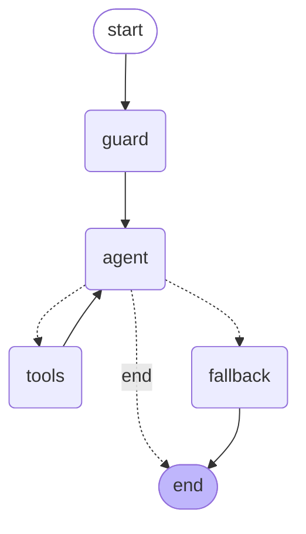

# Albert School — Student Assistant Agent

A LangGraph agent that answers an Albert School student's natural-language
questions about **their own studies**: their program and current courses, a
course's assessment/topics/documents, their attendance, and their grades. It
combines the **live Albert intranet API** and a **RAG retriever** over the
student's official PDF documents as tools, runs on **Groq**, and is used through
a **Streamlit** chat UI.

> Built for the "Introduction to generative AI" final project. It targets both
> the mandatory bar *and* several "Going further" extensions (see
> [Extensions](#going-further-extensions)).

---

## What it does, and why an agent

A student can ask, in French or English and in any order:

- *"Quels cours est-ce que je suis ce semestre ?"*
- *"Quelles sont les modalités d'évaluation du cours d'IA générative ?"*
- *"Quel est mon taux de présence, et où suis-je le moins assidu ?"*
- *"Quelle est ma moyenne par Teaching Unit ?"*
- *"D'après mon relevé officiel, qu'ai-je validé en année 1 ?"*
- *"Si j'ai 70 au CC, 75 au TP et 85 au projet, quelle est ma note finale ?"*

These questions don't map to one fixed pipeline: each needs a **different tool
(or combination of tools)**, the right **identifiers**, and sometimes a
**follow-up computation**. That is exactly what an agent is for — the LLM reads
the request, decides which tool(s) to call, the graph runs them, and the loop
repeats until the model can answer. A linear `prompt | llm` chain could not pick
between attendance, grades, the syllabus API and the document store, nor compose
two of them in one turn.

The data tools do all the arithmetic in Python (pandas) and hand the model
**already-computed** numbers, so the LLM is never trusted to average JSON — it
orchestrates and explains.

---

## Graph design

The agent is the canonical ReAct loop built explicitly as a `StateGraph`, so
every node and edge is visible and testable.



**State** (`TypedDict`) — only the two fields the graph reads or writes:

| Field | Type | Role |
|---|---|---|
| `messages` | `Annotated[list, add_messages]` | chat history + tool results, accumulated via the `add_messages` reducer |
| `iterations` | `int` | tool-loop counter for the current turn (safety harness) |

**Nodes** (each is `State -> partial State`):

| Node | Job |
|---|---|
| `guard` | entry point; resets `iterations` to 0 at the start of every user turn (the checkpointer persists it across turns, so it must be reset) |
| `agent` | calls the Groq LLM (tools bound); it either answers or requests tool calls; increments `iterations` |
| `tools` | runs every requested tool (supports parallel calls), with per-call error handling and de-duplication of identical calls |
| `fallback` | safe exit that returns a graceful message when the loop budget is exhausted |

**The conditional edge** `route_after_agent` is the one real decision point, and
it routes **three different ways** depending on the State:

- **→ `tools`** — the model asked for tool(s) and the loop budget is intact;
- **→ `end`** — the model produced a final answer (no tool calls);
- **→ `fallback`** — the loop budget is exhausted (safety).

Each branch is exercised by the evaluation suite (a greeting routes to `end`, a
data question routes through `tools`, and a budget-capped case routes to
`fallback`), so no branch is dead code.

### System prompt

The prompt is part of the design. The `agent` node prepends this (it is not
stored in the state, to avoid duplication):

```
You are the Albert School student assistant. You help one signed-in student get
clear, accurate answers about their own studies: their program and current
courses, a course's assessment/topics/documents, their attendance, and their
grades.

How to work:
- Always ground answers in tool results. Never invent grades, rates, dates,
  course names or documents. If you don't have it, say so.
- Use your tools to fetch program/course info, attendance rates, grade averages,
  and the official PDF documents; use the calculator for any arithmetic.
- Mind the two grade sources, they are different: the live API grades are on a
  0-100 scale and reflect the current standing; the transcripts in the PDF
  documents are the official historical record on the French /20 scale with
  letter grades and ECTS. Do not mix them, and search the documents when the
  user asks about a past year, a transcript, or their enrollment certificate.
- You may call several tools at once when a question needs more than one, but do
  not call the same tool twice with the same arguments.
- After your tools return, write a complete, direct answer for the student using
  their results — give the actual numbers and facts. Never reply with
  meta-comments about the tool calls, and never mention internal tool or function
  names; describe what you can do in plain words.
- Be concise and factual. Reply in the same language the student used.
```

---

## Tools

Six tools, each with one responsibility and its own error handling (a failure
returns a `⚠️ …` message instead of raising, so one bad call never breaks the
graph).

| Tool | Responsibility | Source |
|---|---|---|
| `list_my_program` | program enrolment + this semester's courses | API: profile + courses |
| `get_course_details` | one course's assessment, topics, documents | API: courses + syllabus + documents |
| `get_attendance_summary` | attendance rate (overall / by course / by month) | API: attendance → pandas |
| `get_grades_summary` | averages (overall / by teaching unit / by course) | API: grades → pandas |
| `search_school_documents` | the enrollment certificate + historical transcripts | RAG: Chroma + FastEmbed |
| `calculator` | safe arithmetic for hypotheticals / cross-source math | local AST evaluator |

**Tools deliberately *not* included.** *Web search* — every question is about the
student's own intranet data; the web adds noise and a chance to answer
off-topic, so it is excluded on purpose. *Database query* — there is no database;
the structured source is the API. *File reader* — reading the PDFs is part of
building the RAG index (`PyPDFLoader`), not a separate runtime tool. This is a
considered tool selection, not the full suggested list.

---

## Key design choices

- **Aggregation in Python, not in the prompt.** Attendance rates and grade
  averages are *derived* (the API returns raw records, never summaries). All of
  that lives in `aggregations.py` with pandas, where the rules are explicit and
  unit-testable; the LLM only relays the result.
- **Two grade scales, kept apart.** The live API grades are on **/100**; the PDF
  transcripts are the official record on **/20** with letter grades and ECTS. The
  system prompt and the tool descriptions keep these from being conflated.
- **The two-identifier trap.** The API uses **two different** student ids —
  `ALBERT_USER_ID` for courses/attendance and `ALBERT_STUDENT_ID` for grades —
  and swapping them returns wrong data with no HTTP error. Each `fetch_*` is
  hard-wired to the correct id.
- **Local embeddings.** Groq has no embeddings endpoint, so the RAG tool uses
  `FastEmbedEmbeddings` (ONNX, no API key, reuses the `onnxruntime` Chroma already
  pulls in) — avoiding the heavy `torch`/`sentence-transformers` path.
- **Caching for Streamlit.** The compiled graph and the Chroma store are built
  once behind `@st.cache_resource`; structural API data (profile, course list) is
  memoised; documents are embedded once and persisted to `.chroma/`.
- **Groq model.** `llama-3.3-70b-versatile` (strong at routing, supports parallel
  tool calls), with automatic fallback to `llama-3.1-8b-instant` on a rate-limit
  or transient API error.

---

## Going further (extensions)

Five extensions, each chosen because it improves *this* assistant rather than to
show off a feature:

1. **Persistence** — a `SqliteSaver` checkpointer keyed by a `thread_id` carried
   in the URL, so a page reload or server restart restores the conversation.
   *Trade-off:* on-disk state must be cleared to truly start over (the "New
   conversation" button issues a fresh id).
2. **Streaming** — every turn streams the agent's steps (which tool, with what
   arguments; when each returns) into a live trace panel, so the reasoning is
   visible. *Trade-off:* `stream_mode="updates"` surfaces post-node updates, so
   the trace is step-level, not token-level.
3. **RAG as a tool** — the Unit-3 retrieval pipeline (`PyPDFLoader` →
   `RecursiveCharacterTextSplitter` → Chroma) is exposed as one tool, giving the
   agent a second, document-grounded source distinct from the live API.
4. **Observability** — every node, routing decision and tool call (name, args,
   outcome, latency) is written as a structured line to `albert_agent.log`;
   LangSmith tracing turns on automatically if a key is present. *Trade-off:* the
   always-on log is local; full prompt/token traces need LangSmith.
5. **Safety harness** — a per-turn tool-loop budget enforced *in the conditional
   edge* (→ `fallback`), a per-call `max_tokens` cap, a graph recursion limit,
   per-tool error handling, and the model fallback above. The budget is part of
   the graph, not a wrapper, which is why it is testable as a routed branch.

Human-in-the-loop and MCP were deliberately skipped: the assistant is read-only
over the student's own data, so an approval gate would be gratuitous.

---

## Evaluation

`evaluation/run_eval.py` runs a small suite (`evaluation/cases.py`). Each case
checks three independent things, so a failure says *where* it broke:

- **route** — which way the conditional edge sent the turn (`tools`/`end`/`fallback`);
- **tools** — the tool(s) that must have been called (routing correctness);
- **content** — regex the answer must contain. The numeric expectations
  (attendance rate, weakest course, overall average) are computed from the
  aggregation layer at run time, so the suite checks the LLM *faithfully relays*
  the deterministic numbers and stays correct as the data changes.

Run it with:

```bash
python -m evaluation.run_eval           # all cases
python -m evaluation.run_eval --tag rag # one category
```

**Result: 11/11 cases pass (100%).** The 11 cases span all six tools and all
three routes, including a budget-capped case that correctly diverts to
`fallback`. The recommended `llama-3.3-70b-versatile` hit its Groq free-tier
**daily token limit** during evaluation, so the suite was run on the comparably
capable `openai/gpt-oss-120b`; while 70b was throttled, the automatic fallback to
`llama-3.1-8b-instant` was observed keeping the agent answering — the safety
harness doing its job.

**Failure modes observed.** (1) The small `8b` fallback model sometimes emits a
meta-comment instead of synthesising the tool results, or calls a tool twice —
mitigated by the prompt and by de-duplicating identical tool calls in the `tools`
node. (2) Content checks are intentionally lenient (keywords / rounded numbers)
to avoid penalising correct answers that phrase a number differently. (3) The
70b daily token limit is the main operational risk; the model fallback trades
answer quality for availability rather than failing the turn.

---

## Three example interactions (tested)

**1 — Program, single tool.** *"Quels cours est-ce que je suis ce semestre ?"*
→ routes to `list_my_program` → answers with the numbered current-term courses:

```
Voici les cours que vous suivez ce semestre :
1. Applied Machine Learning for business (DAT0623) – 2 ECTS – Data – …
2. Business Deep Dive (BUS0636) – 2 ECTS – Business – …
… (19 courses)
```

**2 — Grades + attendance, two tools in one turn.** *"Donne-moi ma moyenne
générale et mon taux de présence global."* → `get_grades_summary` and
`get_attendance_summary` → composed answer:

```
Moyenne générale : 79,5 / 100 (équivalent : 15,9 / 20).
Taux de présence global : 97 % (159 présences sur 164 séances).
```

**3 — Course assessment, syllabus API.** *"Quelles sont les modalités
d'évaluation du cours d'IA générative ?"* → `get_course_details` (resolves the
course, fetches the syllabus) → 

```
Le cours « Introduction to generative AI » (DAT0621) est évalué ainsi :
- CC (30 %) : examen en ligne sécurisé
- TP (30 %) : examen individuel en ligne sécurisé
- PROJ (40 %) : présentation orale en groupe de 3-4
Note finale = 30 % CC + 30 % TP + 40 % PROJ.
```

---

## How to run

```bash
# 1. Install dependencies (uv; never bare pip)
uv pip install -r requirements.txt

# 2. Create a .env at the project root with:
#    ALBERT_PERSONAL_TOKEN=...      ALBERT_USER_ID=...
#    ALBERT_STUDENT_ID=...          GROQ_API_KEY=...
#    (optional)  LANGSMITH_API_KEY=...   ALBERT_AGENT_MODEL=...

# 3. Put the 4 source PDFs in rag/ (see rag/README.md)

# 4. Launch the UI
streamlit run app.py

# 5. (optional) Run the evaluation suite
python -m evaluation.run_eval
```

On first launch the documents are embedded once (FastEmbed downloads a small
ONNX model) and cached to `.chroma/`.

---

## Project structure

```
app.py                      Streamlit chat UI (cached graph, streaming, persistence)
albert_agent/
  config.py                 env + tunable constants (single source of truth)
  observability.py          structured logging + optional LangSmith
  api_client.py             authenticated Albert API wrapper (the two-id trap handled here)
  aggregations.py           pandas: attendance rates, grade averages, term filter
  rag.py                    Chroma + FastEmbed retriever over the PDFs
  tools.py                  the 6 LangChain tools
  graph.py                  State, nodes, conditional edge, checkpointer, system prompt
evaluation/
  cases.py                  test cases + success criteria
  run_eval.py               runner: success rate + failure modes
rag/                        source PDFs (gitignored; see rag/README.md)
requirements.txt            pinned versions
```

The submission excludes secrets (`.env`), personal data (`rag/*.pdf`, `docs/`),
and local caches (`.chroma/`, `*.sqlite`, `*.log`).
